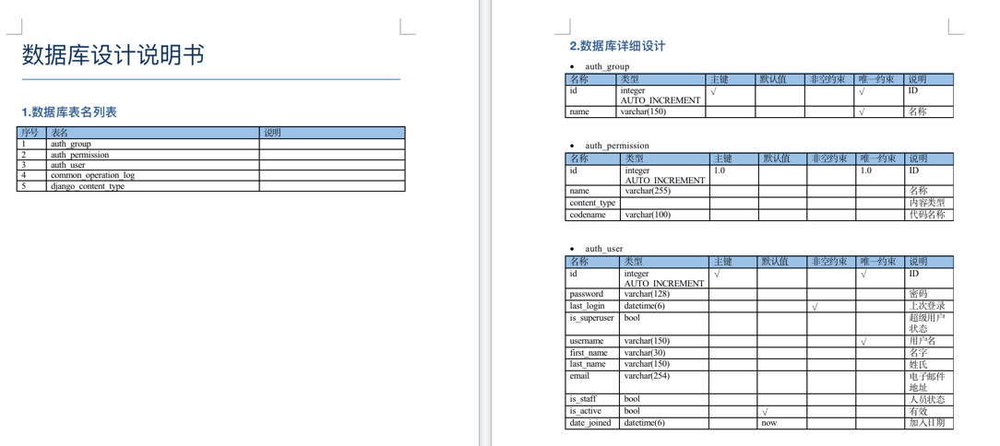
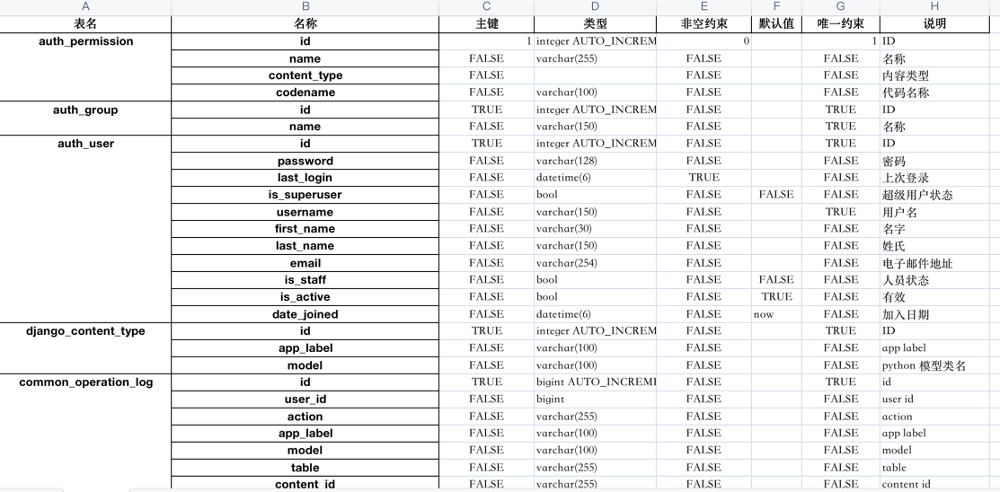

# django-db-doc-generator
a simple database docx generate tool

### How to use?
1. copy db_doc_generate.py to your django scripts directory
2. cd your project root directory
3. python runscript manage.py db_doc_generate --script-args doc

### Screenshot

- doc

- excel 
- 